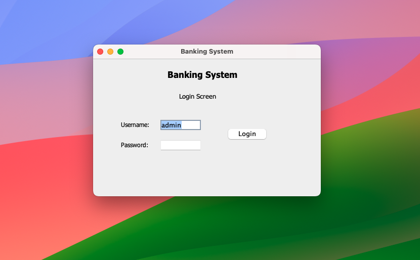
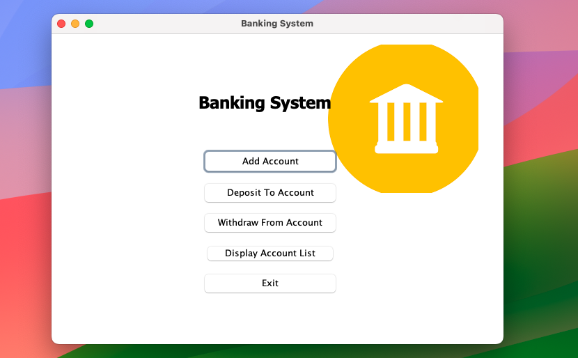

# Banking System - Java Swing Project

## Description
The Banking System is a Java Swing application that simulates basic banking operations. It provides a user-friendly interface for managing accounts, transactions, and other essential banking functions.

## Features
- Account creation and management
- Deposit and withdrawal transactions
- Balance inquiry
- Transaction history
- User-friendly GUI with Java Swing

## Screenshots



## Technologies Used
- Java
- Java Swing for GUI

## Installation
1. Clone the repository:
   ```bash
   git clone https://github.com/your-username/banking-system.git
   cd banking-system
   
   ```
2. Run Project
   ```bash
   javac Main.java
   java Main
   ```
## Usage
1. Launch the application.
2. Follow the on-screen instructions to perform banking operations.

## Contribution
Contributions are welcome! If you'd like to contribute to the project, please follow these steps:

1. Fork the repository
2. Create a new branch (git checkout -b feature/new-feature)
3. Commit your changes (git commit -m 'Add new feature')
4. Push to the branch (git push origin feature/new-feature)
5. Create a pull request

## License
This project is licensed under the MIT License - see the LICENSE file for details.

## Acknowledgments
- Thanks to Java for the programming language.
- Special thanks to Java Swing for the GUI components.
- Feel free to customize the content according to your project's specific details. Add more sections or information as needed.
